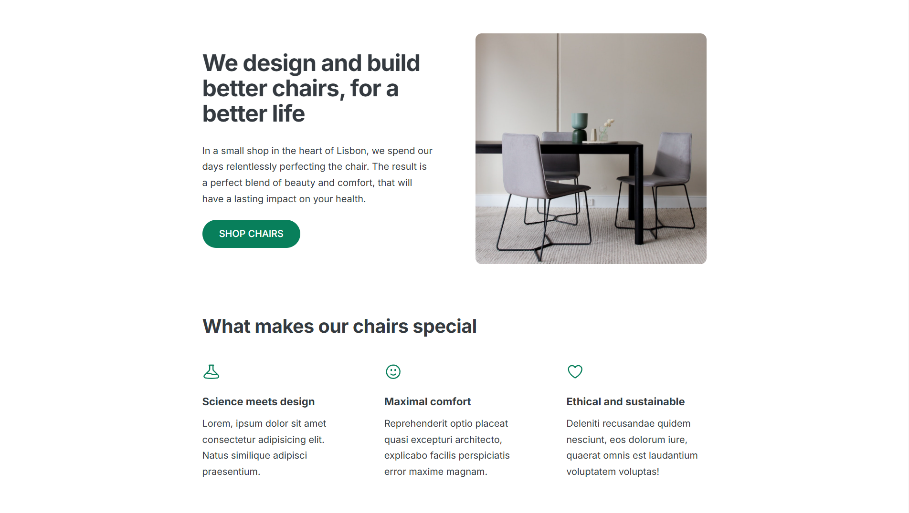
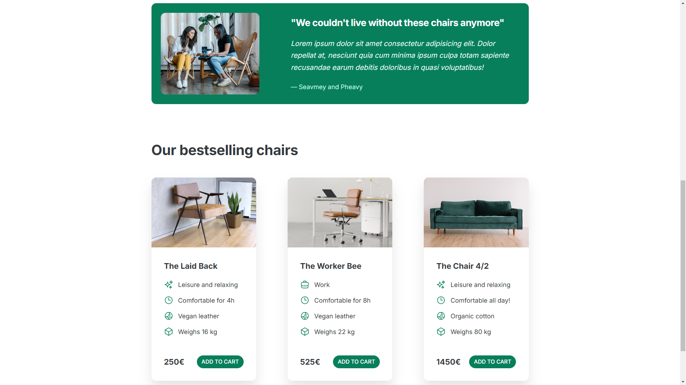

# 🪑 Both Sann Chair Shop 🪑

This project showcases a website for a fictional chair shop located in Lisbon, where we offer a variety of ergonomic, eco-friendly, and stylish chairs. The site includes sections about the brand, features of the chairs, customer testimonials, and best-selling products.💺✨

---

## 🖼️ Screenshots

### Screenshot 1


### Screenshot 2


---

## 🚀 Key Features

- **Hero Section**: Introduction to the brand with a catchy slogan and a "Shop chairs" button. 
- **What Makes Our Chairs Special**: Highlighting the science and comfort behind the designs.
- **Customer Testimonials**: Real stories from satisfied customers.
- **Product Showcase**: Displaying the best-selling chairs with features, prices, and the option to "Add to Cart".

## 🔧 Technologies Used

- HTML5
- CSS3
- SVGs for icons

## 🏗️ Installation & Setup

To view or modify this project locally:

1. Clone the repository:
   ```bash
   git clone https://github.com/BothSann/chairshop-website.git

## 🛠️ Built By

This project was built by **THANN SOPHEAKBOTH** as part of an online learning course by [Jonas Schmedtmann](https://codingheroes.io/).

---

## ©️ Copyright By

© Copyright by **Jonas Schmedtmann**. This project is for educational purposes only and cannot be used for commercial purposes.
